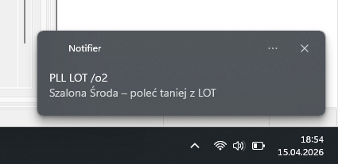
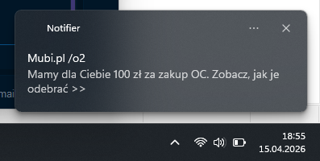

# O2 Mail Notifier
## A lightweight bot for notifications about new messages in your o2.pl email account.

### Quick Start
Installing libraries:

```Bash

pip install -r requirements.txt
```
.env file (create in the root folder), example structure in **.env.example**:

```
email=twoj_mail@o2.pl
password=application_password
mail_list=history.json
```

### Running the application: 
```
python main.py
```

### Automation (Windows)

- Compile to EXE: 
```
pyinstaller --noconsole --onefile main.py.
```

- Add a task in Task Scheduler.

- IMPORTANT: In the action settings, in the “Start in” field, specify the full path to the folder containing the .exe file so that the program can access the .env file.

### Example of operation.


